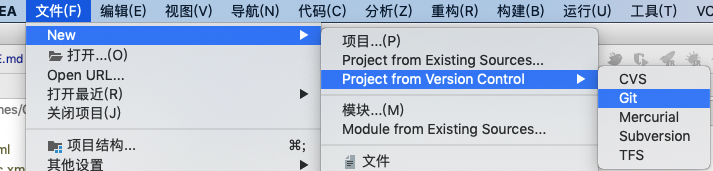

# oa2
 
微服务架构的项目


#### 19/10/05

> consule

./consul agent -dev  


[SpringCloud使用Consul](http://www.pianshen.com/article/1785195291/)

[Spring Cloud中的Consul的相关配置](https://blog.csdn.net/zhaoruda/article/details/80206896)


+ 服务调用方也要配置，否则找不到服务
+ 一定要按照spring.io生成的pom配置在主pom中定义dependencyManagement，否则添加不了discovery依赖

```xml
    <dependency>
        <groupId>org.springframework.cloud</groupId>
        <artifactId>spring-cloud-starter-consul-discovery</artifactId>
    </dependency>
```


#### 19/10/04

>consule

[consul单节点和集群使用配置](https://blog.csdn.net/xiang__liu/article/details/80878537)

[SpringBoot 服务注册 (Consul)](https://blog.csdn.net/liuxiaoxiaosmile/article/details/82970870)

[SpringCloud使用Consul作为分布式配置中心](https://blog.csdn.net/qq_36027670/article/details/79701775)

[Spring Cloud Consul 实现服务注册和发现](https://www.cnblogs.com/scode2/p/8671223.html)

[微服务Consul系列之服务部署、搭建、使用](https://www.imooc.com/article/275704)

[Spring Cloud（二）Consul 服务治理实现](https://www.ymq.io/2017/11/26/spring-cloud-consul/)
 
```html

单节点：

下载consul，并进行安装后，在/usr/local建立相应数据目录。
执行如下命令，启动单节点：

nohup consul  agent -server -data-dir=/usr/local/consul-data/  -node=agent-one -bind=0.0.0.0 -bootstrap-expect=1 -client=0.0.0.0 -ui > /usr/local/consul-data/logs/consul.lo
g 2>&1 & 
 
单节点扩容为集群：

nohup consul agent -bind=0.0.0.0 -client=0.0.0.0 -data-dir=/usr/local/consul-data -node=agent-four -join=172.16.111.130 > /usr/local/consul-data/logs/consul.log 2>&1 &


172.16.111.130为单节点IP。
如果剔除单节点，只需要在相应被踢出的服务器上执行：consul leave
等待24-72小时，集群节点会删除相关节点信息。 
```


#### 19/10/03


[springboo-aop-示例实现，并讨论多个切面的多个切点的执行顺序](https://blog.csdn.net/matrixbbs/article/details/89241005)

[记录异常和返回值的解决方案](#mycat2)


记录异常方式一：

+ 这种方式拿不到参数和返回值只能统一处理异常
+ 你也可以在自己的工程中使用自定义的异常切面，但是要调整和comm表中的顺序

```java
////通用包里有全局异常处理
@ComponentScan(value = {"comm"
//取消controller中的try catch，交由GlobalExceptionHandler去捕获
```


ControllerAspect方式二： 

可以拿到请求参数和返回，但是需要区分是否文件上传请求


#### 19/09/30

> 如何记录异常和返回值？<a name="mycat2"></a>

[Spring Boot Controller 统一返回格式](https://www.jianshu.com/p/b4d67167e43c)


#### 19/09/29


> 简单分片

```html
<table name="bd_customer" primaryKey="id" dataNode="dn1,dn3" rule="bd_customer_master"/>
```


> Mycat ER 分片 [](#mycat1)


```html
<table name="bd_customer" primaryKey="id" dataNode="dn1,dn3" rule="bd_customer_master">
    <childTable name="bd_customer_education" primaryKey="id" joinKey="cusid" parentKey="id" />
</table>
```


> 分片视图查询
```html
<table name="v_customer" dataNode="dn1,dn3" />
```


> 定义全局表，编辑字典表会对所有的表生效

```html
<table name="dict" primaryKey="id" dataNode="dn1,dn3" type="global" />
```


<hr>

> [SpringBoot 使用@RequestBody 接受不到参数的问题](https://blog.csdn.net/weixin_37603867/article/details/81298440)

> [Spring Boot 参数校验](https://www.cnblogs.com/cjsblog/p/8946768.html)

> [bean validation 分组验证及分组顺序](https://blog.csdn.net/win7system/article/details/51241837)

#### 19/09/28

> Lombok 链式调用会导致BeanUtils方法失效


#### 19/09/24 <a name="mycat1"></a>

 
bd_customer做了水平拆分，关联表需要拆分吗？子表数据可能比主表还多

> 启动mycat

./mycat start

> 查看日志

cd ../logs

tail -f wrapper.log 

tail -f mycat.log


#### 19/09/22
不同模块相互调用

[MyBatis Plus之主键为uuid设计为Long型带来的问题](https://www.jianshu.com/p/d7d63696eb89)


#### 19/09/21

[Feign常见问题](http://www.imooc.com/article/289005)

[Feign深入](http://www.itmuch.com/spring-cloud/finchley-10/)

[声明式HTTP客户端](https://blog.51cto.com/zero01/2424667)

#### 19/09/20
> POM 

　　GroupId和ArtifactId被统称为“坐标”是为了保证项目唯一性而提出的，如果你要把你项目弄到maven本地仓库去，你想要找到你的项目就必须根据这两个id去查找。

　　GroupId一般分为多个段，这里我只说两段，第一段为域，第二段为公司名称。域又分为org、com、cn等等许多，其中org为非营利组织，com为商业组织。举个apache公司的tomcat项目例子：这个项目的GroupId是org.apache，它的域是org（因为tomcat是非营利项目），公司名称是apache，ArtifactId是tomcat。
　　
　　比如我创建一个项目，我一般会将GroupId设置为cn.mht，cn表示域为中国，mht是我个人姓名缩写，ArtifactId设置为testProj，表示你这个项目的名称是testProj，依照这个设置，在你创建Maven工程后，新建包的时候，包结构最好是cn.zr.testProj打头的，如果有个StudentDao[Dao层的]，它的全路径就是cn.zr.testProj.dao.StudentDao


 
#### 19/09/19
> Feign

[Feign的配置方式](https://segmentfault.com/a/1190000019802108)

[Feign的方式](http://www.imooc.com/article/47310)

[Spring cloud feign](https://www.jianshu.com/p/abc33207dda8)


SpringCloud Feign 替换默认配置，不加 @Configuration怎么理解？
在学习Feign的时候有看到替换默认配置要么把配置类创建到启动类外层目录，这样要加@Configuration注解，要么是放在同级或下级目录，此时不加@Configuration。
但是实际实验结果表示，放在同级或下级目录，不加@Configuration，则会报错，或者不生效。
那么该怎么理解官方文档的这段话呢？


FooConfiguration不需要使用@Configuration注释。但是，如果是，则请注意将其从任何@ComponentScan中排除，否则将包含此配置，因为它将成为feign.Decoder，feign.Encoder，feign.Contract等的默认来源，指定时。这可以通过将其放置在任何@ComponentScan或@SpringBootApplication的单独的不重叠的包中，或者可以在@ComponentScan中明确排除


```JAVA
// 启动类在com.vvlin包下
package com.vvlin.config;
//...
// 这里注释掉之后，不会在控制台打印，说明方法未调用
// 不注释则正常
// @Configuration
public class FeignUploadFileConfiguration {
    @Bean
    public Encoder feignFormEncoder() {
        System.err.println("FeignUploadFileConfiguration.feignFormEncoder()");
        return new springFormEncoder();
    }
}


```
 
 
 
 
 

##### 19/09/13
>增加common


##### 19/09/08

> 修改idea内存 

如果修改内存无效请使用此命令搜索.vmoptions文件： sudo find / -name idea.vmoptions


>  GIT初始化 
 

  